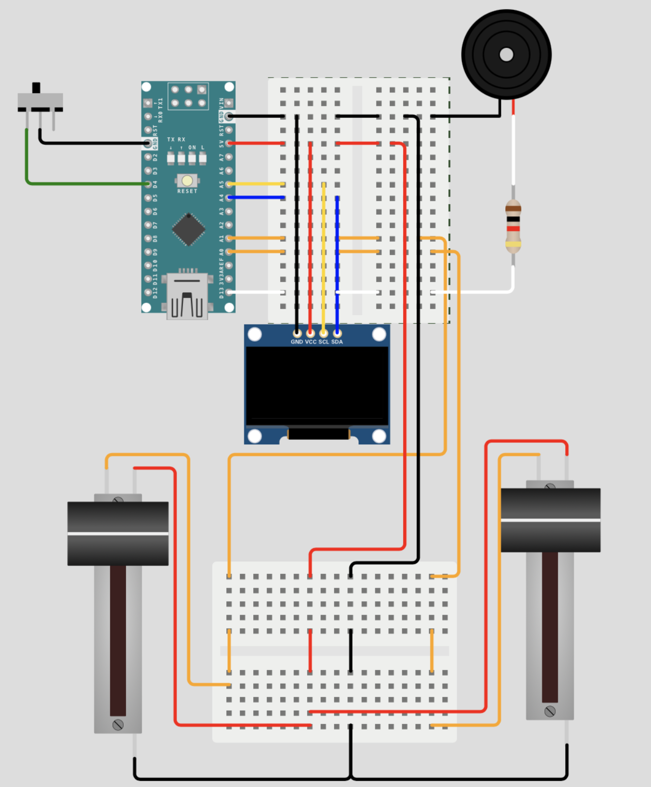

# ArduinoPong

A two-player (or single-player vs. AI) arcade-style Pong game implemented on an **Arduino Nano** with an **SSD1306 OLED display**, **slide potentiometers** for paddle control, and optional sound via a **buzzer**.

---

## Table of Contents

* [Overview](#overview)
* [Features](#features)
* [Hardware Requirements](#hardware-requirements)
* [Wiring](#wiring)
* [Software Requirements](#software-requirements)
* [Installation](#installation)
* [Usage](#usage)
* [Repository Structure](#repository-structure)
* [Live Simulation](#live-simulation)
* [License & Credits](#license--credits)

---

## Overview

ArduinoPong brings back the retro charm of Pong with a modern microcontroller twist. Designed as part of a final project for **Course 0512-4494 (Real-Time Lab)** at **Tel Aviv University**, this game runs smoothly on an Arduino Nano, complete with:

1. **Dual Game Modes**:
   * **Two-player mode**: Each player controls a paddle using a slide potentiometer.
   * **Single-player mode**: Play against a built-in AI opponent.

2. **State Machine Game Engine**:
   * Cleanly separated setup, gameplay, and game-over states.
   * OLED screen rendering via I²C using Adafruit GFX & SSD1306 drivers.

3. **Live Feedback**:
   * Sound effects via buzzer.
   * Start screen, scorekeeping, and win screen on OLED.

---

## Features

* ⚙️ **Dual Game Modes**: Single vs. AI or two-player.
* 🎮 **Smooth Analog Paddle Control** using slide potentiometers.
* 📺 **OLED Rendering** via I²C (Adafruit SSD1306).
* 🔊 **Sound Support** with a piezo buzzer.
* 🧠 **Finite State Machine** logic for structured gameplay.
* 🧼 **Noise Filtering** for stable paddle behavior.
* 🕹️ **Joystick-controlled UI (planned)** for menu navigation.

---

## Hardware Requirements

* **Arduino Nano**
* **SSD1306 OLED Display (I²C)**
* **2× Slide Potentiometers**
* **Slide Switch**
* **1× Buzzer**
* **1× 1kΩ Resistor**
* Breadboards and jumper wires

---

## Wiring

|     Component     | Arduino Pin | Notes                          |
|------------------:|:------------|:-------------------------------|
| OLED SDA          | A4          | I²C Data                       |
| OLED SCL          | A5          | I²C Clock                      |
| OLED VCC / GND    | 5V / GND    | Power                          |
| Potentiometer 1   | A0          | Player 1 paddle                |
| Potentiometer 2   | A1          | Player 2 or AI input           |
| Slide Switch      | D4          | Selects game mode              |
| Buzzer (+)        | D13         | Sound output (with 1kΩ resistor) |
| Buzzer (–)        | GND         | Ground                         |

See full connection layout in [`diagram.json`](./diagram.json)

---

## Software Requirements

* Arduino IDE or PlatformIO
* Required libraries (see [`libraries.txt`](./libraries.txt)):
  - Adafruit GFX Library
  - U8g2_for_Adafruit_GFX
  - Adafruit SSD1306

---

## Installation

```bash
git clone https://github.com/aimanabed/ArduinoPong.git
cd ArduinoPong
```
Open pong.ino in the Arduino IDE.
Install dependencies via Library Manager.
Connect your Arduino Nano and select the right COM port and board.
Usage

Wire hardware as described above.
Upload the code (pong.ino) to your Arduino Nano.
Use the slide switch to select:
Left = Two-Player Mode
Right = Single-Player Mode
Move paddles via potentiometers.
Buzzer plays sounds on collisions and scores.
Repository Structure

```
ArduinoPong/
├── pong.ino                   # Main Arduino sketch
├── diagram.json               # Wokwi wiring diagram
├── libraries.txt              # Required Arduino libraries
├── presentation2_pong.pptx    # Final project presentation
└── README.md                  # This file
```
##  Live Simulation

Click below to try the **Arduino Pong Game** in Wokwi:

[](https://wokwi.com/projects/429208251543079937)

[](https://wokwi.com/projects/429208251543079937)


## License & Credits

Tel Aviv University Educational License (TAU-EL)

Copyright (c) 2025 Aiman Abed

This project was developed as part of the Real-Time Systems Laboratory course (0512-4494) at Tel Aviv University.

Permission is hereby granted, free of charge, to use, copy, modify, and distribute this project and its components for **educational and non-commercial purposes**, subject to the following conditions:

1. This software is provided for academic and instructional purposes only.
2. Any reuse, modification, or publication must credit the original authors and Tel Aviv University.
3. This license does not grant permission for commercial use or redistribution in compiled or uncompiled form.
4. The software is provided "as is", without warranty of any kind, express or implied.

For permissions beyond the scope of this license, please contact Tel Aviv University or the original authors.

Developed by:

Aiman Abed – developer
Edward Khoury – Co-developer

<p align="center">
  
</p>

